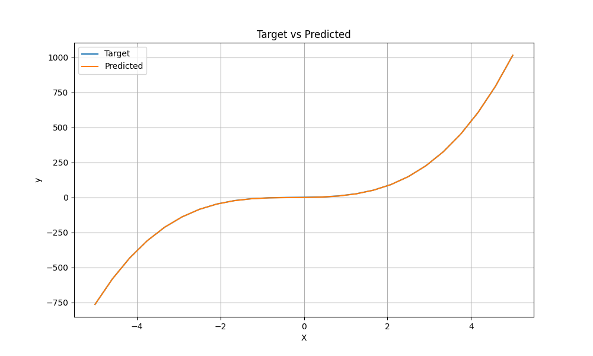
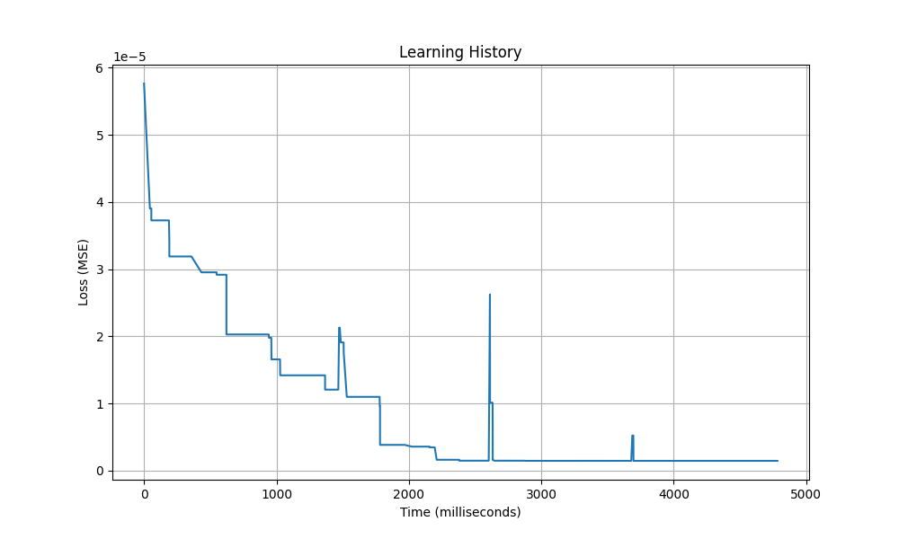
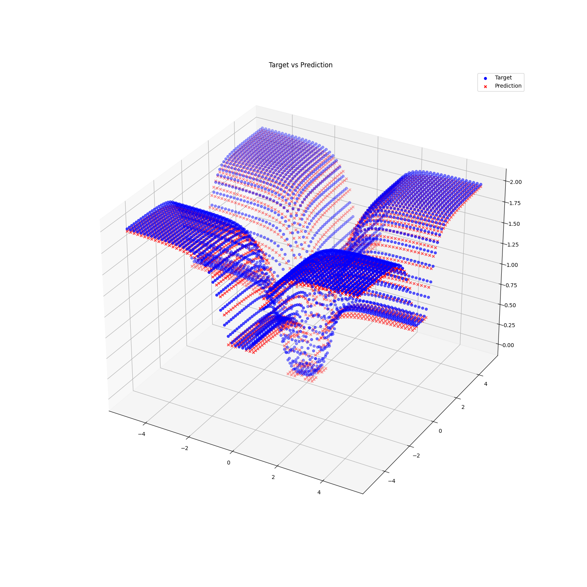

# QuickSR
Hybrid CPU/GPU implementation of symbolic regression with genetic programming, backpropagation and bytecode virtual machine

<div style="display: inline-block;">
  
  
</div>

<div style="display: inline-block;">
  
  
</div>

## Installation
```
# On Fedora
sudo dnf install gcc gcc-c++ make cmake -y
sudo dnf install rocminfo rocm-opencl rocm-clinfo rocm-hip rocm-hip-devel amd-smi -y
sudo dnf install python3 python3-devel -y
sudo dnf install libasan libubsan -y
sudo dnf install doxygen -y

git clone https://github.com/kocatepedogu/quick-symbolic-regression.git
cd quick-symbolic-regression
git submodule update --init --recursive

cmake .
make -j$(nproc)
export PYTHONPATH=$(pwd)
```

The *make* command generates a shared library which can be imported as an extension module to python, and a set of test executables written in C++.

For performance benchmarks, run

```
python3 ./benchmark/benchmark_population_size.py
python3 ./benchmark/benchmark_dataset_size.py
```

For loss benchmarks on test datasets, run

```
python3 ./benchmark/benchmark1d.py # Single feature
python3 ./benchmark/benchmark2d.py # Two features
```

## Documentation

Documentation of QuickSR can be found at [quick-symbolic-regression-docs.readthedocs.io](https://quick-symbolic-regression-docs.readthedocs.io). 

To generate low-level documentation of the codebase and the project internals, run `doxygen Doxyfile` in the root directory.

## Algorithm

At the beginning, a random population of expressions (in parse tree form) is generated. The trees contain nodes of unary operations (sin, cos, exp), binary operations (+, -, *, /), variables/features (x0, x1, ...), constants (c0, c1, ...), and trainable parameters (w0, w1, ...) which are initially random but are later trained using gradient descent.

At each solution iteration, expressions in tree form are converted into programs of bytecode instructions implementing forward propagation and backpropagation. As an example, the bytecode representation of the expression `w0 * cos(x)*x + x*x - w1` is as follows:

```
 0 var 0
 1 param 0
 2 var 0
 3 cos
 4 mul
 5 mul
 6 var 0
 7 var 0
 8 mul
 9 add
10 param 1
11 sub
12 loss
13 grad_sub [9]
14 grad_add [7]
15 grad_mul [3]
16 grad_var 0 [0]
17 grad_mul [1]
18 grad_param 0 [0]
19 grad_cos [0]
20 grad_var 0 [0]
21 grad_mul [5]
22 grad_var 0 [5]
23 grad_var 0 [5]
24 grad_param 1 [9]
```

Two arrays are used for the execution. The (1) *stack* array stores transient function inputs and outputs just like in an ordinary stack-based VM, whereas the (2) *intermediate* array is used for preserving intermediate calculation results computed during forward propagation. This second array is later used in backpropagation to determine outgoing gradients. The square brackets in the gradient instructions denote the array location to which the associated intermediate value was saved.

The bytecode programs are executed in parallel, which can be in the form of (1) multiple instructions on the same data point, (2) single instruction on multiple datapoints, or (3) both, with GPU acceleration using ROCm HIP. The trainable parameters (w0, w1, ...) in expressions are learned using gradient descent and the remaining MSE loss at the end of training is saved for every expression. The associated expressions are then compared with respect to their losses, and the good ones are selected as parents. Crossover and mutation operations are applied on the CPU to produce the next offspring. The procedure repeats *ngenerations* times.

The entire process described above is executed concurrently for multiple populations (also referred to as "island"s). Each island is associated with a distinct HIP stream and a distinct OpenMP thread. At regular intervals (a few generations), these streams/threads are synchronized with barriers and some individuals migrate between the islands. The overall procedure is repeated *nsupergenerations* times.

The project's uniqueness comes from the use of backpropagation and gradient descent for learning constants, which has historically been a problem in genetic programming. The hyperparameters of gradient descent -the number of epochs and the learning rate- can be controlled through the API. While the project aims to benefit from derivatives, it is possible to disable this feature entirely by setting the number of epochs to zero. In that case, the algorithm relies only on mutation and crossover for generating constants.

The library is implemented in C++/HIP, and the API is provided in Python through pybind11.

## Modes

There are four modes: (1) **inter-individual GPU**, (2) **intra-individual GPU**, (3) **hybrid GPU** and (4) **CPU**.

In the **inter-individual GPU mode** (1), the parallelization is done over individuals. At each generation, a single kernel (per island) is launched on the stream associated with an island. Every GPU thread processes a different individual's bytecode program. When the loss computation/gradient accumulation from one data point is done, the threads move on to the next data point in a sequential loop. The loop over epochs is also moved inside the kernel, eliminating kernel launch overhead. 

The **intra-individual GPU mode** (2) parallelizes over data points. For each individual, a new kernel is launched on the stream associated with the individual's island. The kernel executes the same bytecode program over all data points in parallel. The losses and gradients from different data points are computed by different threads, so the final results are obtained by reduction summation on the GPU. After one individual is done, the next one is processed in a sequential loop.

The **hybrid GPU mode** (3) parallelizes over both individuals and data points. At each generation, a single kernel (per island) is launched with number of threads equal to 32 times the number of individuals per island. Every consecutive set of 32 threads (wave/warp) run the same bytecode program for different data points, with a sequential stride loop over the dataset for the remaining data points. The loop over epochs is also moved inside the kernel, eliminating kernel launch overhead. 

The **CPU mode** (4) uses multiple CPU cores to process multiple islands with no involvement of the GPU. Vectorization using OpenMP SIMD is used for some genetic operations, but the execution of bytecode programs is not currently vectorized. This mode is added for comparison.

## Benchmarks


The first plot shows the elapsed time of the algorithm as a function of the population size, measured by *benchmark_population_size.py* script. The hybrid GPU mode significantly outperforms the CPU mode (near 2x speedup) on large populations.


The second plot shows the elapsed time of the algorithm as a function of dataset size, measured by *benchmark_dataset_size.py* script. While the CPU mode is initially better, the intra-individual GPU mode eventually outperforms the CPU implementation on large dataset sizes.

The inter-individual mode was not included as it was inferior in both types of benchmarks, potentially due to the divergence of control flow in consecutive threads. Nevertheless, it is included as part of QuickSR.

Both benchmarks were done on an Intel Core i7 1400KF CPU (64 GB DDR5 5200 MHz RAM) and an AMD Radeon RX 9060 XT (16GB VRAM) GPU. Either with a large dataset size or a large population size, the GPU implementation significantly outperforms the CPU one. However, it is important to note that choosing the correct mode is crucial for performance, which is up to the user.

