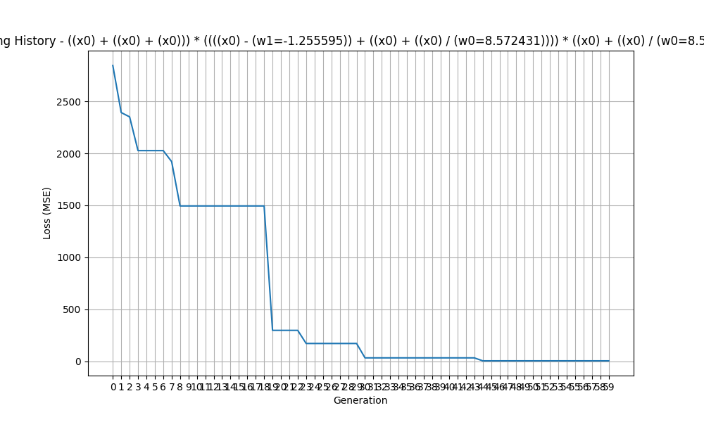
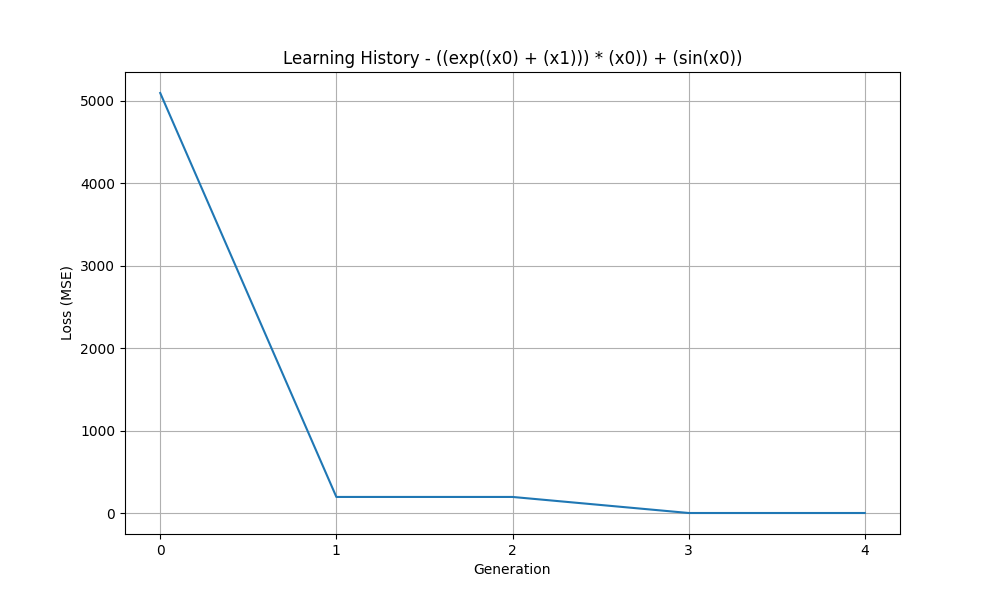
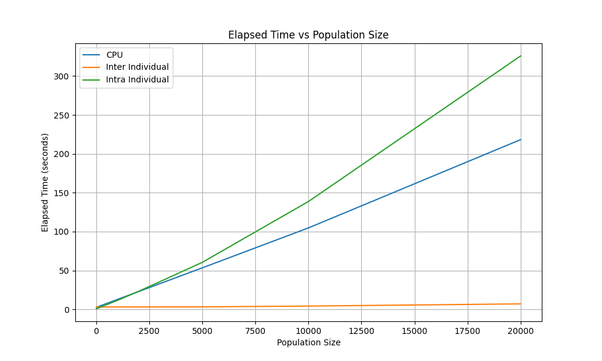

# QuickSR
Hybrid CPU/GPU implementation of symbolic regression with genetic programming, backpropagation and bytecode virtual machine

### Algorithm

At the beginning, a random population of expressions (in parse tree form) is generated. The trees contain nodes of unary operations (sin, cos, exp), binary operations (+, -, *, /), variables/features (x0, x1, ...), constants (c0, c1, ...), and trainable parameters (w0, w1, ...) which are initially random but can be trained using gradient descent.

At each solution iteration, expressions in tree form are converted into vectors (also referred to as "program"s) of bytecode instructions implementing forward propagation and backpropagation. The resulting programs are then executed in parallel (either multiple instructions on the same data point, or single instruction on multiple datapoints) with GPU acceleration using ROCm HIP. The programs update trainable parameters (w0, w1, ...) in expressions using gradient descent and report the remaining MSE loss at the end of training. The associated expressions are then compared with respect to their losses, and the good ones are selected as parents. Crossover and mutation operations are applied on the CPU to produce the next offspring. The procedure repeats ngenerations times.

The entire process described above is executed concurrently for multiple populations (also referred to as "island"s). Each island is associated with a distinct HIP stream and a distinct OpenMP thread. At regular intervals (a few generations), these streams/threads are synchronized with barriers and some individuals migrate between the islands. The overall procedure is repeated nsupergenerations times.

The project's uniqueness comes from the use of backpropagation and gradient descent for learning constants, which has historically been a problem in genetic programming. The hyperparameters of gradient descent -the number of epochs and the learning rate- can be controlled through the API. While the project aims to benefit from derivatives, it is possible to disable this feature entirely by setting the number of epochs to zero. In that case, the algorithm relies only on mutation and crossover for generating constants.

The library is implemented in C++/HIP, and the API is provided in Python through pybind11.

### Modes

There are three modes: (1) **CPU**, (2) **intra-individual GPU**, and (3) **inter-individual GPU**. 

The **CPU mode** (1) assigns each island to a separate OpenMP thread. Within each island, there is a nested parallel for over individuals. Nested parallelism ensures that, when the computation in an island finishes earlier than others, the associated core does not stay idle. Vectorization using OpenMP SIMD is used for some genetic operations, but the execution of bytecode programs is currently not vectorized. Entire process is done on the CPU.

The **intra-individual GPU mode** (2) assigns each island to a separate HIP stream with further parallelization over data points. For each individual, a new kernel is launched on the stream associated with the individual's island. The kernel executes the same bytecode program over all data points in parallel. Since the losses and gradients from different data points are computed by different threads, the results are summed by reduction on the GPU. After one individual is done, the next one is processed in a sequential loop.

The **inter-individual GPU mode** (3) assigns each island to a separate HIP stream with further parallelization over individuals. At each generation, only a single kernel is launched on the stream associated with the island. Every GPU thread processes a different individual's bytecode program. When the loss computation/gradient accumulation from one data point is done, the threads move on to the next data point in a sequential loop. The loop over epochs is also moved inside the kernel, eliminating kernel launch overhead. 

The plot above shows the elapsed time of the algorithm as a function of the population size, measured by *benchmark__population_size.py* script. At the largest benchmark population size (560000), the inter-individual GPU mode achieves a speedup of 31x over the CPU mode and 46x over the intra-individual GPU mode. The dataset size is kept constant at 25 data points.

