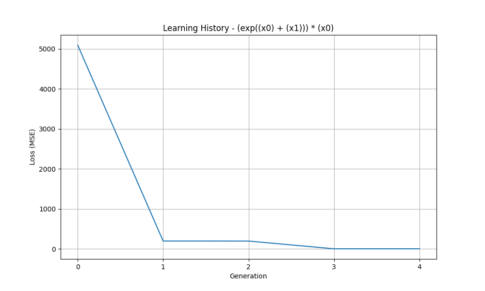

# QuickSR
Hybrid CPU/GPU implementation of symbolic regression with genetic programming, backpropagation and bytecode virtual machine

**Summary Of The Algorithm**

At the beginning, a random population of expressions (in parse tree form) is generated. The trees contain nodes of unary operations (sin, cos, exp), binary operations (+, -, *, /), variables/features (x0, x1, ...), constants (c0, c1, ...), and trainable parameters (w0, w1, ...) which are initially random but can be trained using gradient descent.

At each solution iteration, expressions in tree form are converted into vectors (also referred to as "program"s) of bytecode instructions implementing forward propagation and backpropagation. The resulting programs are then executed in parallel (either multiple instructions on the same data point, or single instruction on multiple datapoints) with GPU acceleration using ROCm HIP. The programs update trainable parameters (w0, w1, ...) in expressions using gradient descent and report the remaining MSE loss at the end of training. The associated expressions are then compared with respect to their losses, and the good ones are selected as parents. Crossover and mutation operations are applied on the CPU to produce the next offspring. The procedure repeats ngenerations times.

The entire process described above is executed concurrently for multiple populations (also referred to as "island"s). Each island is associated with a distinct HIP stream and a distinct OpenMP thread. At regular intervals (a few generations), these streams/threads are synchronized with barriers and some individuals migrate between the islands. The overall procedure is repeated nsupergenerations times.

The project's uniqueness comes from the use of backpropagation and gradient descent for learning constants, which has historically been a problem in genetic programming. The hyperparameters of gradient descent -the number of epochs and the learning rate- can be controlled through the API. While the project aims to benefit from derivatives, it is possible to disable this feature entirely by setting the number of epochs to one. In that case, the algorithm relies only on mutation and crossover for generating constants.

The library is implemented in C++/HIP, and the API is provided in Python through pybind11. An example script (benchmark.py) is provided in the repository.
